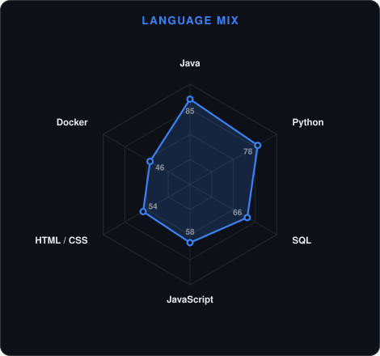
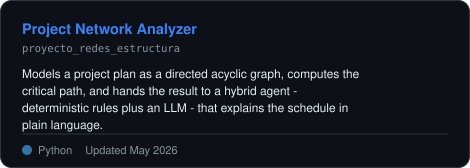
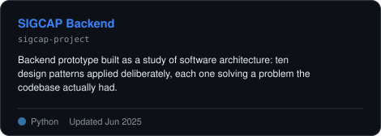
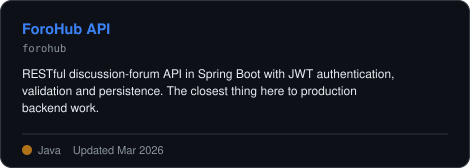
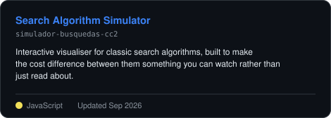

<!-- Hero banner. Generated by scripts/banner.py from assets/banner.json.
     Edit the JSON, not the SVG: the Assets workflow redraws both themes. -->
<picture>
  <source media="(prefers-color-scheme: dark)"  srcset="assets/banner-dark.svg">
  <source media="(prefers-color-scheme: light)" srcset="assets/banner-light.svg">
  
</picture>

 

 

<!-- LinkedIn keeps its brand blue on purpose: shields.io drops the white
     glyph against a custom fill, and the badge ends up unreadable. -->

&nbsp;&nbsp;

&nbsp;&nbsp;

---

## About

I'm **Luis**, a Systems Engineering student finishing my degree and building backend
services while I do it. Most of what I write is Java and Spring Boot on one side and
Python on the other, and lately I've been pulling large language models into that work
to see what they're genuinely good for.

- 🎓 **Close to graduating in Systems Engineering.** Coursework is where I picked up
  graphs, hashing and search algorithms, and I keep going back to them.
- ☕ **Java and Spring Boot are where I'm most comfortable.** REST APIs, JWT
  authentication, persistence, dependency injection - the ordinary backend work.
- 🐍 **Python is the other half.** Currently training in backend development with
  Python and applied AI at Platzi.
- 🤖 **Interested in agents that do real work.** My favourite project so far pairs a
  directed acyclic graph with a hybrid agent - deterministic rules plus an LLM - so the
  model explains a result it did not invent.
- 🎯 **Looking for my first software engineering internship.** If you're hiring
  juniors for backend work, I'd like to hear from you.

 

## Stack

---

## Signals

<table>
<tr>
<td width="50%" align="center" valign="middle">

<!-- Self-rated. Edit assets/skills.json and the Assets workflow redraws it. -->
<picture>
  <source media="(prefers-color-scheme: dark)"  srcset="assets/radar-dark.svg">
  <source media="(prefers-color-scheme: light)" srcset="assets/radar-light.svg">
  
</picture>

</td>
<td width="50%" align="center" valign="middle">

<!-- Hand-authored language stack. Edit assets/langmix.json. -->
<picture>
  <source media="(prefers-color-scheme: dark)"  srcset="assets/radar-langs-dark.svg">
  <source media="(prefers-color-scheme: light)" srcset="assets/radar-langs-light.svg">
  
</picture>

</td>
</tr>
</table>

---

## Numbers

<!-- Generated by scripts/cards.py into this repo. Deliberately NOT
     github-readme-stats or streak-stats: those are shared public instances,
     and when they rate-limit this whole section turns into a broken image. -->
<picture>
  <source media="(prefers-color-scheme: dark)"  srcset="assets/card-stats-dark.svg">
  <source media="(prefers-color-scheme: light)" srcset="assets/card-stats-light.svg">
  
</picture>

<!-- Averaged per repo rather than summed by bytes: one project carrying a
     vendored bundle would otherwise drown out everything else. -->
<picture>
  <source media="(prefers-color-scheme: dark)"  srcset="assets/card-languages-dark.svg">
  <source media="(prefers-color-scheme: light)" srcset="assets/card-languages-light.svg">
  
</picture>

---

## Featured work

<table>
<tr>
<td width="50%" align="center">

<a href="https://github.com/luviuche/proyecto_redes_estructura">
<picture>
  <source media="(prefers-color-scheme: dark)"  srcset="assets/card-proyecto_redes_estructura-dark.svg">
  <source media="(prefers-color-scheme: light)" srcset="assets/card-proyecto_redes_estructura-light.svg">
  
</picture>
</a>

</td>
<td width="50%" align="center">

<a href="https://github.com/luviuche/sigcap-project">
<picture>
  <source media="(prefers-color-scheme: dark)"  srcset="assets/card-sigcap-project-dark.svg">
  <source media="(prefers-color-scheme: light)" srcset="assets/card-sigcap-project-light.svg">
  
</picture>
</a>

</td>
</tr>
<tr>
<td width="50%" align="center">

<a href="https://github.com/luviuche/forohub">
<picture>
  <source media="(prefers-color-scheme: dark)"  srcset="assets/card-forohub-dark.svg">
  <source media="(prefers-color-scheme: light)" srcset="assets/card-forohub-light.svg">
  
</picture>
</a>

</td>
<td width="50%" align="center">

<a href="https://github.com/luviuche/simulador-busquedas-cc2">
<picture>
  <source media="(prefers-color-scheme: dark)"  srcset="assets/card-simulador-busquedas-cc2-dark.svg">
  <source media="(prefers-color-scheme: light)" srcset="assets/card-simulador-busquedas-cc2-light.svg">
  
</picture>
</a>

</td>
</tr>
</table>

---

## Recent activity

<!--START_SECTION:activity-->
<!--END_SECTION:activity-->

---

Every chart on this page is generated by <a href="scripts/">scripts/</a> and served from this repo.

