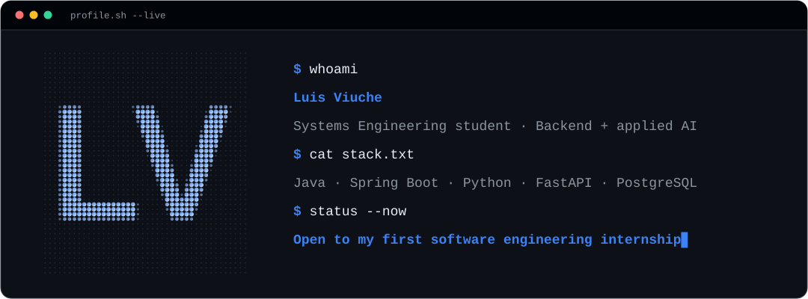
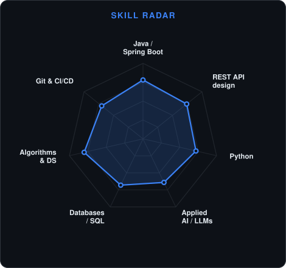
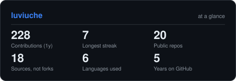
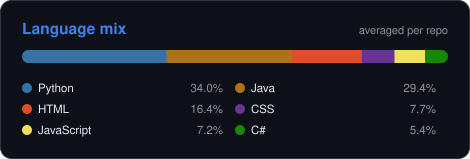

<!-- Hero banner. Generated by scripts/banner.py from assets/banner.json.
     Edit the JSON, not the SVG: the Assets workflow redraws both themes. -->
<picture>
  <source media="(prefers-color-scheme: dark)"  srcset="assets/banner-dark.svg">
  <source media="(prefers-color-scheme: light)" srcset="assets/banner-light.svg">
  
</picture>

 

 

<!-- LinkedIn keeps its brand blue on purpose: shields.io drops the white
     glyph against a custom fill, and the badge ends up unreadable. The rest
     follow the page theme through <picture>. -->

&nbsp;
<a href="https://x.com/ViucheLM"><picture><source media="(prefers-color-scheme: dark)" srcset="https://img.shields.io/badge/X-0d1117?style=for-the-badge&logo=x&logoColor=3B82F6"><source media="(prefers-color-scheme: light)" srcset="https://img.shields.io/badge/X-f6f8fa?style=for-the-badge&logo=x&logoColor=2563EB"></picture></a>
&nbsp;
<a href="https://instagram.com/lmviuche"><picture><source media="(prefers-color-scheme: dark)" srcset="https://img.shields.io/badge/Instagram-0d1117?style=for-the-badge&logo=instagram&logoColor=3B82F6"><source media="(prefers-color-scheme: light)" srcset="https://img.shields.io/badge/Instagram-f6f8fa?style=for-the-badge&logo=instagram&logoColor=2563EB"></picture></a>
&nbsp;
<a href="mailto:lmvm.zzz@gmail.com"><picture><source media="(prefers-color-scheme: dark)" srcset="https://img.shields.io/badge/Email-0d1117?style=for-the-badge&logo=gmail&logoColor=3B82F6"><source media="(prefers-color-scheme: light)" srcset="https://img.shields.io/badge/Email-f6f8fa?style=for-the-badge&logo=gmail&logoColor=2563EB"></picture></a>
&nbsp;
<picture><source media="(prefers-color-scheme: dark)" srcset="https://img.shields.io/badge/limrnc.-0d1117?style=for-the-badge&logo=discord&logoColor=3B82F6"><source media="(prefers-color-scheme: light)" srcset="https://img.shields.io/badge/limrnc.-f6f8fa?style=for-the-badge&logo=discord&logoColor=2563EB"></picture>

  

---

## About

I'm **Luis**, a Systems Engineering student in Bogotá, Colombia. I write Java and Spring
Boot on one side and Python on the other, and I'm working my way toward applied AI — the
part where a model does real work inside a service instead of just answering questions.

- 🎓 **Universidad Distrital Francisco José de Caldas**, graduating in the first half of
  2027. Coursework is where I picked up graphs, hashing and search algorithms, and I keep
  going back to them.
- ☕ **Java and Spring Boot is where I'm most comfortable.** REST APIs, JWT authentication,
  persistence, dependency injection — ordinary backend work, done properly.
- 🐍 **Python is the other half.** I'm specialising in backend development with applied
  AI at Platzi — engineering fundamentals, Git, the terminal and SQL are behind me, with
  FastAPI, LLM APIs, LangChain and agents ahead.
- 🤖 **Agents that do real work.** My favourite project so far,
  [project-network-analyzer](https://github.com/luviuche/project-network-analyzer),
  pairs a directed acyclic graph with a hybrid agent — deterministic rules plus an LLM —
  so the model explains a result it did not invent.
- 🐧 **Linux desktop customisation.** I run CachyOS and rice my setup the way other
  people rearrange furniture.
- 🎯 **Looking for my first internship.** If you're hiring juniors for backend work, I'd
  like to hear from you.

**Talk to me about** backend engineering, AI agents, whatever new tooling is actually
worth the hype, or how to make a Linux desktop look good.

 

## Stack

---

## Signals

<!-- Self-rated, and the only chart here that is. Edit assets/skills.json and
     the Assets workflow redraws it. There used to be a second, hand-authored
     language radar beside this one; it was dropped because the measured
     language card below already answers that question, and two invented
     charts disagreeing with one measured chart cost all three their
     credibility. -->
<picture>
  <source media="(prefers-color-scheme: dark)"  srcset="assets/radar-dark.svg">
  <source media="(prefers-color-scheme: light)" srcset="assets/radar-light.svg">
  
</picture>

---

## Numbers

<!-- Generated by scripts/cards.py into this repo. Deliberately NOT
     github-readme-stats or streak-stats: those are shared public instances,
     and when they rate-limit this whole section turns into a broken image. -->
<picture>
  <source media="(prefers-color-scheme: dark)"  srcset="assets/card-stats-dark.svg">
  <source media="(prefers-color-scheme: light)" srcset="assets/card-stats-light.svg">
  
</picture>

<!-- Averaged per repo rather than summed by bytes: one project carrying a
     vendored bundle would otherwise drown out everything else. -->
<picture>
  <source media="(prefers-color-scheme: dark)"  srcset="assets/card-languages-dark.svg">
  <source media="(prefers-color-scheme: light)" srcset="assets/card-languages-light.svg">
  
</picture>

---

## Recent activity

<!--START_SECTION:activity-->
1. 🎉 Merged PR [#6](https://github.com/luviuche/hotel-pms/pull/6) in [luviuche/hotel-pms](https://github.com/luviuche/hotel-pms)
2. 💪 Opened PR [#6](https://github.com/luviuche/hotel-pms/pull/6) in [luviuche/hotel-pms](https://github.com/luviuche/hotel-pms)
3. 🎉 Merged PR [#5](https://github.com/luviuche/hotel-pms/pull/5) in [luviuche/hotel-pms](https://github.com/luviuche/hotel-pms)
4. 🔒 Closed issue [#3](https://github.com/luviuche/mi-primer-repo/issues/3) in [luviuche/mi-primer-repo](https://github.com/luviuche/mi-primer-repo)
5. ℹ️ Assigned issue [#5](https://github.com/luviuche/mi-primer-repo/issues/5) in [luviuche/mi-primer-repo](https://github.com/luviuche/mi-primer-repo)
<!--END_SECTION:activity-->

---

Every chart on this page is generated by <a href="scripts/">scripts/</a> and served from this repo.

